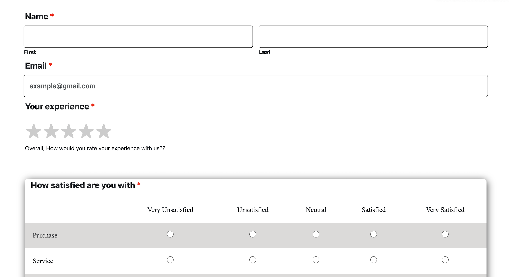
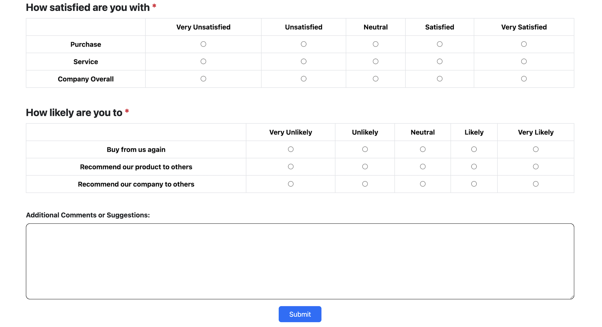

# 🌐 HTML & CSS Survey Form — Professional Project

[](https://github.com/TheComputationalCore/html-css-survey-form/actions/workflows/deploy.yml)
[](https://github.com/TheComputationalCore/html-css-survey-form/actions/workflows/html-lint.yml)
[](https://github.com/TheComputationalCore/html-css-survey-form/actions/workflows/css-lint.yml)
[](https://github.com/TheComputationalCore/html-css-survey-form/actions/workflows/prettier.yml)
[](LICENSE)

A modern, responsive, and fully accessible **Survey Form** built using **HTML5**, **CSS3**, and **Bootstrap 5**.  
Includes CI/CD automation with GitHub Actions, auto-formatting, linting, and GitHub Pages deployment.

---

## 🚀 Live Demo  
👉 **https://thecomputationalcore.github.io/html-css-survey-form/**

---

## 📂 Project Structure  
```
html-css-survey-form/
├── index.html
├── q.css
├── screenshots/
│   ├── 1.png
│   ├── 2.png
├── .stylelintrc.json
├── .github/workflows/
│   ├── deploy.yml
│   ├── html-lint.yml
│   ├── css-lint.yml
│   ├── prettier.yml
└── README.md
```

---

## ✨ Features

### 🧩 **Form Sections**
- First & Last Name  
- Email with validation  
- Star Rating System ⭐⭐⭐⭐⭐  
- Satisfaction Table  
- Likelihood Table  
- Comments/Suggestions  
- Submit Button  

### ♿ **Accessibility**
- Proper label associations  
- Semantic structure  
- Screen-reader friendly  
- Color contrast compliant  

### 📱 **Responsive Design**
- Mobile-friendly tables  
- Flexible layout  
- Adaptive star rating  

### 🎨 **Clean UI**
- Card-based layout  
- Shadows & hover effects  
- Smooth spacing and typography  

---

## 🛠 Tech Stack Badges


---

## 📸 Screenshots  

### **Screenshot 1**  


### **Screenshot 2**  


---

## ▶️ Run Locally

1. Clone the repository:
   ```bash
   git clone https://github.com/TheComputationalCore/html-css-survey-form.git
   ```
2. Open in browser:
   ```
   index.html
   ```

---

## 📜 License  
Licensed under the **MIT License**.

---

## 🌟 Author  
**TheComputationalCore**  
Crafting polished, professional frontend projects.
